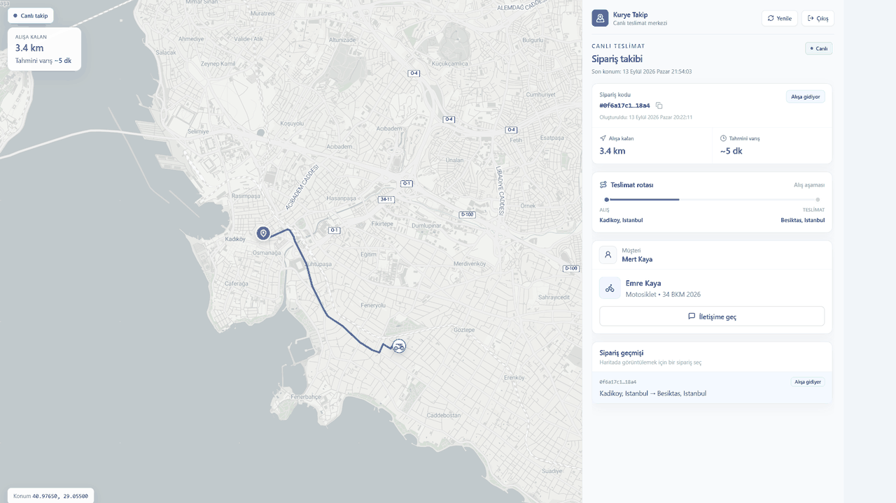

<div align="center">

# Live Courier Tracking

Nearest courier via Redis GEO, live map over STOMP WebSocket.

</div>

A customer creates an order. The API assigns the nearest available courier (Redis GEO, 10 km). The courier’s location is pushed to a React + Leaflet map over JWT-secured WebSocket (RabbitMQ STOMP relay).

## Demo

Local after Quick Start: **http://localhost:3000**



| Login | Map | Panel | API |
|---|---|---|---|
|  |  |  |  |

## Quick start

Needs [Docker](https://docs.docker.com/get-docker/) with Compose, and Git.

```bash
git clone https://github.com/BerkMermer/Live-Courier-Tracking.git
cd Live-Courier-Tracking
cp .env.example .env
# set POSTGRES_PASSWORD and JWT_SECRET  (openssl rand -base64 32)
docker compose up --build -d
```

| | URL |
|---|---|
| Map | http://localhost:3000 |
| API / Swagger | http://localhost:8080/swagger-ui.html |

```bash
docker compose down
```

Do not commit `.env`.

## Architecture


Topic: `/topic/courier-location.{courierId}`

## Stack

Java 17 · Spring Boot 4 · PostgreSQL 16 · Flyway · Redis GEO · RabbitMQ STOMP · JWT · React 18 · Leaflet · Docker Compose · Kustomize (local) · Testcontainers

## How to try the API

Swagger → **Authorize** with `Bearer <JWT>`:

1. `POST /api/v1/auth/register` (customer) and `POST /api/v1/auth/register-courier`
2. `POST /api/v1/auth/login` — copy the token
3. Courier token: `PUT /api/v1/couriers/location`
4. Customer token: `POST /api/v1/orders`
5. Courier token: `POST /api/v1/orders/{id}/assign-courier`
6. Open the map, then courier `pickup` → `deliver`

Frontend without Compose: `cd frontend && npm install && npm run dev`

## API

Swagger: http://localhost:8080/swagger-ui.html

**Auth** `/api/v1/auth` — public `register`, `register-courier`, `login`

**Orders** `/api/v1/orders`

| Method | Path | Who |
|--------|------|-----|
| POST | `/` | CUSTOMER |
| GET | `/me`, `/{id}` | owner (courier/admin on detail) |
| POST | `/{id}/cancel` | CUSTOMER, `PENDING` only |
| DELETE | `/{id}` | CUSTOMER, `CANCELLED` / `DELIVERED` (soft delete) |
| POST | `/{id}/assign-courier` | COURIER / ADMIN |
| POST | `/{id}/pickup`, `/{id}/deliver` | assigned courier |

**Couriers** `/api/v1/couriers` — `PUT /location` (COURIER), `GET /{id}/location` (customer needs an active order)

## Tests

```bash
./mvnw test      # macOS / Linux — Docker must be running (Testcontainers)
mvnw.cmd test    # Windows
```

Unit + MockMvc tests, plus integration tests for the order flow, concurrent assignment, and WebSocket/BOLA checks.

## Kubernetes

Manifests are for a **local** cluster (minikube, Docker Desktop Kubernetes, or kind) — not AWS/GCP.

```powershell
.\scripts\k8s-deploy.ps1 -Minikube
```

If NodePort is not on localhost:

```powershell
kubectl -n courier-tracking port-forward svc/courier-frontend 18080:80
```

Then open http://127.0.0.1:18080 — cluster Postgres is empty, so register from the login page first.

Details: [docs/K8S.md](docs/K8S.md)

## Security (short)

JWT + roles. Order and live-location access are ownership-checked (REST and STOMP topic). Passwords are BCrypt. Secrets stay in local `.env`; the K8s script creates a Secret at deploy time.

## License

All Rights Reserved — [LICENSE](LICENSE).

**Berk Coşkun Mermer** · [GitHub](https://github.com/BerkMermer) · [LinkedIn](https://linkedin.com/in/berkcoskunmermer)
