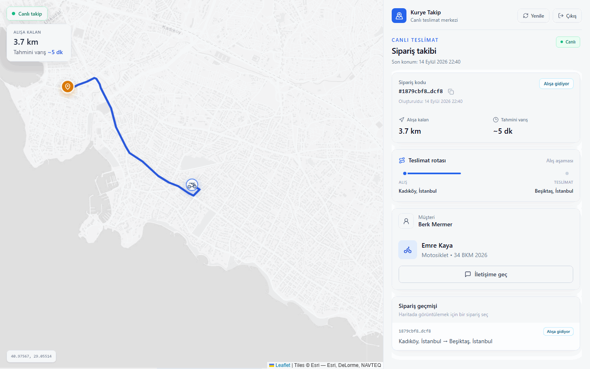
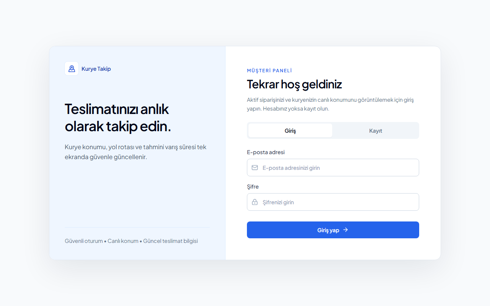
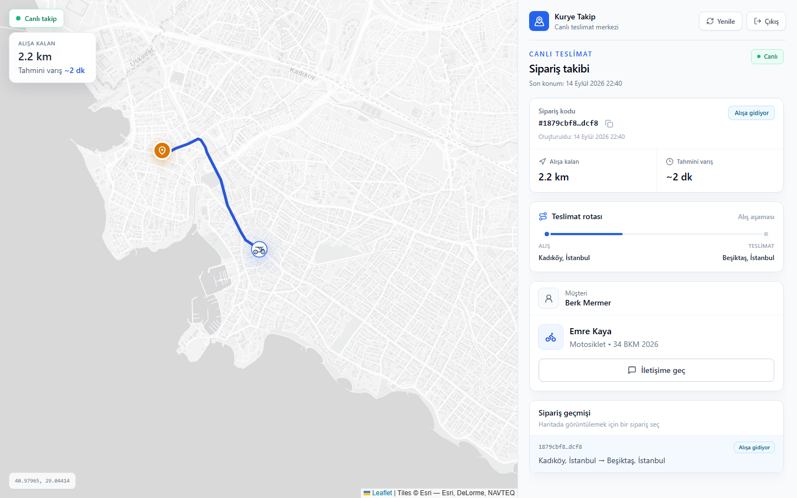
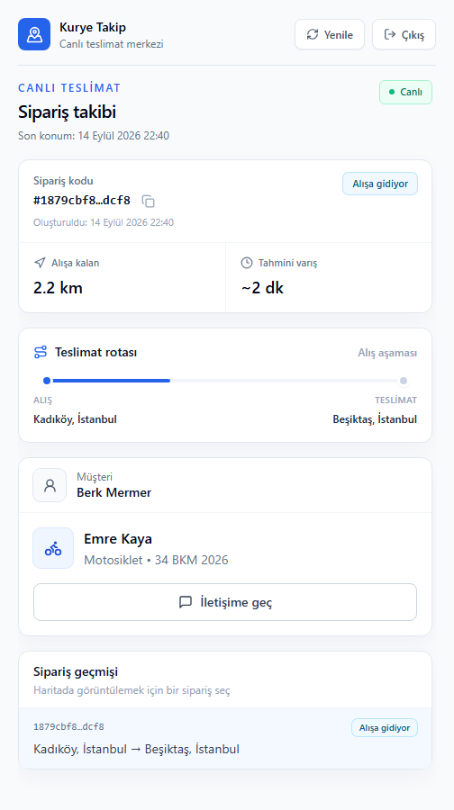
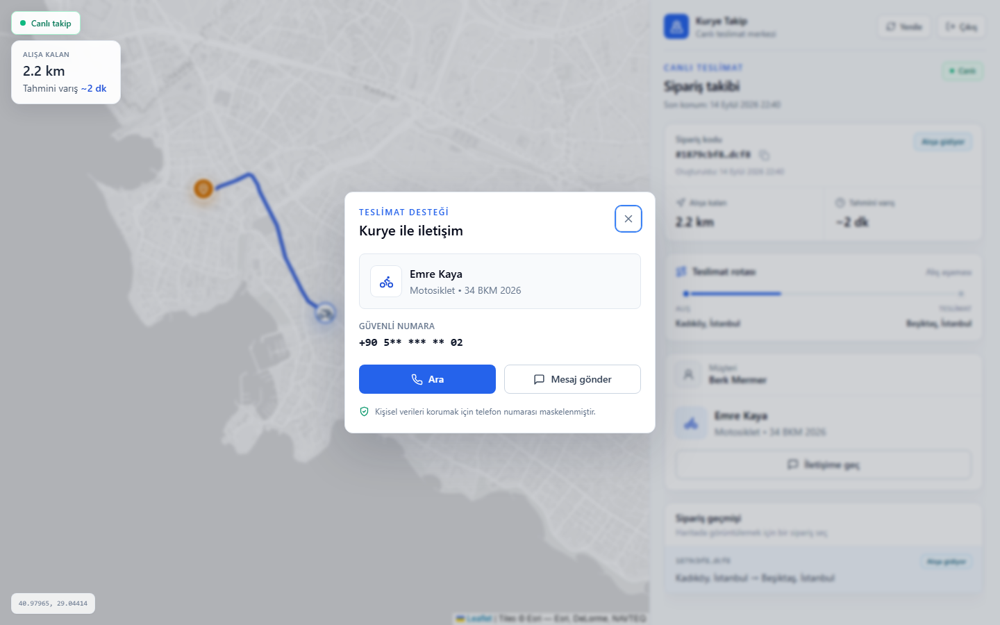
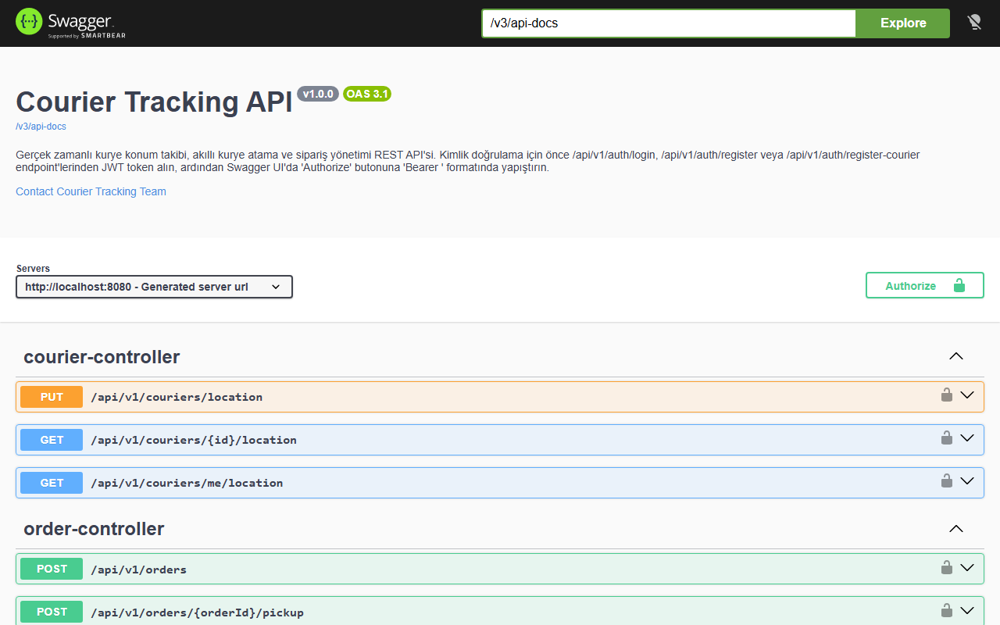

<div align="center">

# Live Courier Tracking

Nearest courier via Redis GEO, live map over STOMP WebSocket.

</div>

A customer creates an order. The API assigns the nearest available courier within 10 km (Redis GEO). The courier’s location streams to a React + Leaflet map over a JWT-secured WebSocket (RabbitMQ STOMP relay).

## Demo

After Quick start: **http://localhost:3000**



| Login | Map | Panel | Contact | API |
|---|---|---|---|---|
|  |  |  |  |  |

## Quick start

Needs [Docker](https://docs.docker.com/get-docker/) with Compose, and Git.

```bash
git clone https://github.com/BerkMermer/Live-Courier-Tracking.git
cd Live-Courier-Tracking
cp .env.example .env
# set POSTGRES_PASSWORD and JWT_SECRET  (openssl rand -base64 32)
docker compose up --build -d
```

| Service | URL |
|---|---|
| Map | http://localhost:3000 |
| API / Swagger | http://localhost:8080/swagger-ui.html |

```bash
docker compose down
```

Do not commit `.env`.

Frontend only (API already running): `cd frontend && npm install && npm run dev`

## Architecture


`PUT /api/v1/couriers/location` writes Redis GEO (nearest-courier search) and publishes to `/topic/courier-location.{courierId}` so subscribed map clients update live.

## Stack

Java 17 · Spring Boot 4 · PostgreSQL 16 · Flyway · Redis GEO · RabbitMQ STOMP · JWT · React 18 · Leaflet · Docker Compose · Kustomize (local) · Testcontainers

## Usage

Open Swagger → **Authorize** with `Bearer <JWT>`:

1. `POST /api/v1/auth/register` (customer) and `POST /api/v1/auth/register-courier`
2. `POST /api/v1/auth/login` — copy the token
3. Courier token: `PUT /api/v1/couriers/location`
4. Customer token: `POST /api/v1/orders`
5. Courier token: `POST /api/v1/orders/{id}/assign-courier`
6. Open the map (customer login), then courier `pickup` → `deliver`

Fresh database has no users — register once, or use the login/register tabs on the map UI.

## Tests

```bash
./mvnw test      # macOS / Linux — Docker must be running (Testcontainers)
mvnw.cmd test    # Windows
```

Unit, MockMvc, and integration tests for the order flow, concurrent assignment, and WebSocket topic authorization.

## Kubernetes

Local cluster only (minikube / Docker Desktop / kind):

```powershell
.\scripts\k8s-deploy.ps1 -Minikube
```

Details: [docs/K8S.md](docs/K8S.md)

## Security

JWT + roles. Order and live-location access are ownership-checked on REST and STOMP subscribe. Passwords are BCrypt. Secrets stay in local `.env`; the K8s script creates a Secret at deploy time.

## License

All Rights Reserved — [LICENSE](LICENSE).

**Berk Coşkun Mermer** · [GitHub](https://github.com/BerkMermer) · [LinkedIn](https://linkedin.com/in/berkcoskunmermer)
