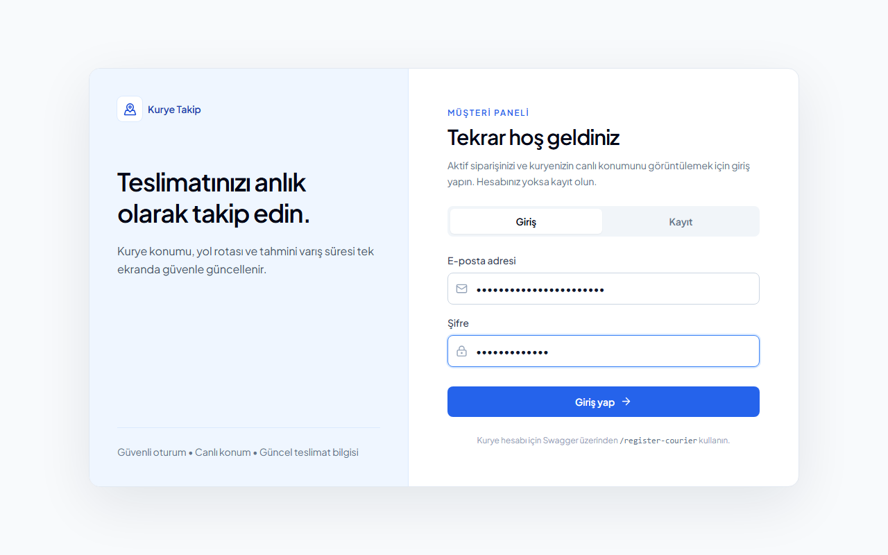
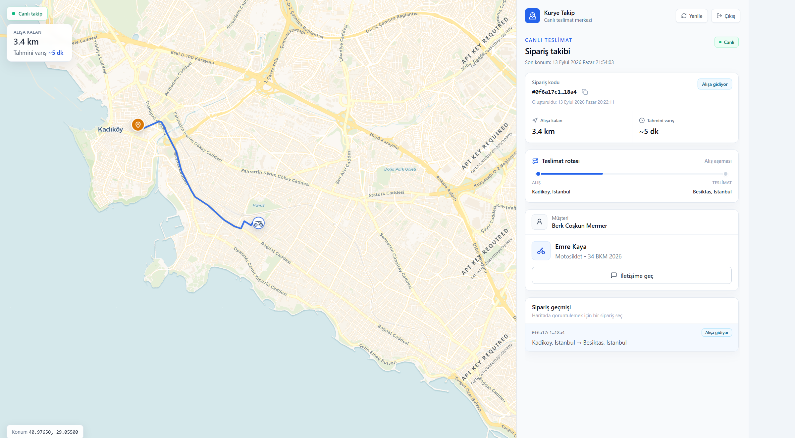
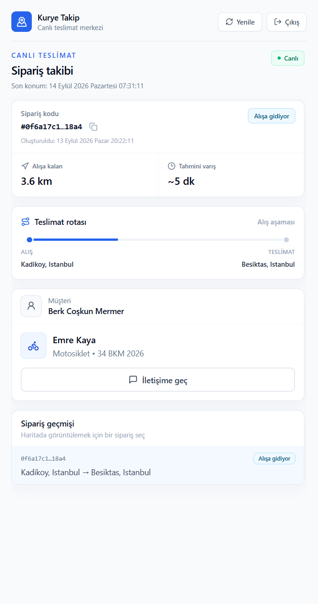
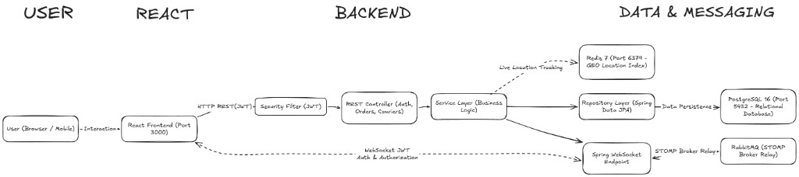

<div align="center">

# Live Courier Tracking

Real-time courier location tracking with nearest-courier assignment (Redis GEO) and a live map over STOMP WebSocket.

Internship / portfolio demo — intentionally scoped, not a production product.

[](https://openjdk.org/)
[](https://spring.io/projects/spring-boot)
[](https://www.postgresql.org/)
[](https://redis.io/)
[](https://www.rabbitmq.com/)
[](https://www.docker.com/)
[](https://kubernetes.org/)
[](https://react.dev/)
[](LICENSE)

[Quick Start](#quick-start) · [API](#api-reference) · [Issues](https://github.com/BerkMermer/live-courier-tracking/issues)

</div>

---

## Table of Contents

- [About](#about)
- [Demo](#demo)
- [Quick Start](#quick-start)
- [Architecture](#architecture)
- [Features](#features)
- [Tech Stack](#tech-stack)
- [Usage](#usage)
- [API Reference](#api-reference)
- [Kubernetes](#kubernetes)
- [Project Structure](#project-structure)
- [Security](#security)
- [Testing](#testing)
- [Contributing](#contributing)
- [License](#license)

---

## About

A customer places an order, the nearest available courier is assigned, and the courier’s location is streamed to a React map over WebSocket (JWT-secured REST + realtime backend).

| | |
|---|---|
| **Auth** | JWT with roles `CUSTOMER`, `COURIER`, `ADMIN` |
| **Assignment** | Redis GEO (`GEORADIUS`, 10 km); courier must have sent `PUT /couriers/location` |
| **Realtime** | RabbitMQ STOMP broker relay |
| **Orders** | Numeric `id` in API JSON, UUID `trackingNumber`, soft delete, ownership checks |
| **Ops** | Docker Compose stack; Kubernetes (Kustomize) with probes, Secret/ConfigMap, StatefulSet, Ingress, HPA |

### Out of scope

| Topic | Note |
|-------|------|
| Guest checkout | Authentication is required |
| Payments, push, admin UI | Not part of this demo |

---

## Demo

There is no hosted public URL. After [Quick Start](#quick-start), the live map (STOMP + courier movement) is at **http://localhost:3000**.

| Login & panel | Map & API |
|---|---|
|  |  |
|  |  |

---

## Quick Start

**Prerequisites:** [Docker](https://docs.docker.com/get-docker/) with Compose, and Git. JDK 17 is needed only to run tests on the host.

```bash
git clone https://github.com/BerkMermer/live-courier-tracking.git
cd live-courier-tracking

cp .env.example .env
# set POSTGRES_PASSWORD and JWT_SECRET (openssl rand -base64 32)

docker compose up --build -d
```

| Service | URL |
|---------|-----|
| Frontend | http://localhost:3000 |
| API | http://localhost:8080 |
| Swagger UI | http://localhost:8080/swagger-ui.html |
| RabbitMQ Management | http://localhost:15672 |

```bash
docker compose logs -f app
docker compose down
```

Do not commit `.env`. Port or Windows Compose issues: [docs/K8S.md](docs/K8S.md#docker-compose-on-windows).

---

## Architecture



Location topic: `/topic/courier-location.{courierId}` (`.` instead of `/` — RabbitMQ nested STOMP destinations).

---

## Features

- **Auth** — `POST /register` and `POST /login` return a JWT. Public registration is always `CUSTOMER`. Endpoints use `@PreAuthorize` plus service-layer ownership checks.
- **Orders** — create, list (`/me`), detail, cancel (`PENDING` only). `assign-courier` picks the nearest `AVAILABLE` courier from Redis GEO (10 km). Assigned courier: `pickup` (`ASSIGNED` → `PICKED_UP`), then `deliver` (`PICKED_UP` → `DELIVERED`, courier `AVAILABLE` again).
- **Location** — `PUT /couriers/location` writes PostgreSQL, Redis GEO, and STOMP. A customer may `GET` a courier’s location only with an active order (`ASSIGNED` / `PICKED_UP`).
- **Map** — Leaflet + OSRM route, motorcycle marker, remaining distance / ETA, order history.

---

## Tech Stack

Versions live here (badges above are the stack, not a second copy of every number).

| Layer | Stack |
|-------|--------|
| Backend | Java 17, Spring Boot **4.0.7**, Spring Security + JWT, Spring Data JPA |
| Database / cache | PostgreSQL 16, Flyway, Redis 7 (GEO) |
| Realtime | STOMP WebSocket + SockJS, RabbitMQ (broker relay) |
| API docs | SpringDoc OpenAPI (Swagger UI) |
| Frontend | React 18, Vite, Tailwind CSS, Leaflet + OSRM |
| Test / ops | JUnit, Mockito, Testcontainers, JaCoCo, Docker Compose, Kubernetes (Kustomize) |

Spring Boot **4.0.7** is the parent in `pom.xml` (not a 3.x typo).

---

## Usage

Swagger: http://localhost:8080/swagger-ui.html — **Authorize** with `Bearer <JWT>`.

1. `POST /api/v1/auth/register` — create a customer
2. `POST /api/v1/auth/register-courier` — create a courier (user + profile)
3. `POST /api/v1/auth/login` — copy the JWT (switch tokens as needed)
4. Courier JWT: `PUT /api/v1/couriers/location`
5. Customer JWT: `POST /api/v1/orders` — use `id` from the response
6. Courier JWT: `POST /api/v1/orders/{id}/assign-courier`
7. Open http://localhost:3000
8. Courier JWT: `POST /api/v1/orders/{id}/pickup` then `/deliver`

Frontend without Compose: `cd frontend && npm install && npm run dev`.

---

## API Reference

Interactive docs: http://localhost:8080/swagger-ui.html

### Auth — `/api/v1/auth`

| Method | Path | Access | Description |
|--------|------|--------|-------------|
| POST | `/register` | Public | Customer register → JWT |
| POST | `/register-courier` | Public | Courier register (user + profile) → JWT |
| POST | `/login` | Public | Login and return JWT |

### Orders — `/api/v1/orders`

| Method | Path | Access | Description |
|--------|------|--------|-------------|
| POST | `/` | CUSTOMER | Create order |
| GET | `/me` | CUSTOMER | List own orders |
| GET | `/{orderId}` | CUSTOMER / COURIER / ADMIN | Detail (ownership enforced) |
| POST | `/{orderId}/cancel` | CUSTOMER | Cancel order |
| POST | `/{orderId}/assign-courier` | ADMIN / COURIER | Assign nearest courier |
| POST | `/{orderId}/pickup` | COURIER | `ASSIGNED` → `PICKED_UP` (assigned courier only) |
| POST | `/{orderId}/deliver` | COURIER | `PICKED_UP` → `DELIVERED`; courier becomes `AVAILABLE` |

### Couriers — `/api/v1/couriers`

| Method | Path | Access | Description |
|--------|------|--------|-------------|
| PUT | `/location` | COURIER | Update location |
| GET | `/{id}/location` | CUSTOMER / ADMIN | Get courier location |
| GET | `/me/location` | COURIER | Get own location |

---

## Kubernetes

Local overlay: `k8s/overlays/local`. From the repo root:

```powershell
.\scripts\k8s-deploy.ps1
```

```bash
./scripts/k8s-deploy.sh
```

Manifest rationale, kind / Docker Desktop image loading, NodePort vs port-forward, and first-user registration: **[docs/K8S.md](docs/K8S.md)**.

---

## Project Structure

```text
live-courier-tracking/
├── src/main/java/com/berk/courier_tracking_api/
│   ├── config/          # Redis, Swagger, WebSocket (RabbitMQ relay)
│   ├── controller/      # Auth, Order, Courier
│   ├── dto/ entity/ enums/ exception/ repository/
│   ├── security/        # JWT filter, WebSocket auth
│   └── service/         # Order, Courier, Redis GEO
├── src/main/resources/
│   ├── application.yaml
│   └── db/migration/    # Flyway
├── src/test/            # Unit (Mockito) + integration (Testcontainers)
├── frontend/            # React + Vite + Leaflet
├── k8s/                 # Kustomize base + local overlay
├── scripts/             # k8s-deploy.ps1 / k8s-deploy.sh
├── docs/
│   ├── K8S.md
│   ├── architecture.png
│   └── screenshots/
├── Dockerfile
├── docker-compose.yml
├── LICENSE
└── README.md
```

---

## Security

| Topic | Approach |
|-------|----------|
| Auth | JWT (HS256), stateless. Local demo: default secret in yaml / `.env` |
| BOLA | Order detail/cancel: ownership. Courier location + STOMP topic: customer must have an active order with that courier |
| WebSocket | Handshake origins = REST CORS allowlist. Subscribe only `/topic/courier-location.{id}` |
| Roles | `POST /register` → `CUSTOMER`; `POST /register-courier` → `COURIER` + profile |
| Passwords | BCrypt |
| Soft delete | `deleted_at` + `@SQLRestriction` |
| CORS | Allowlist (`app.cors.allowed-origins`) for REST and SockJS |
| Actuator | `/actuator/health` public; other actuator endpoints not exposed |
| Out of scope | Rate limit, HTTPS, token revocation — local Compose demo, not a hosted product |

---

## Testing

| Layer | What |
|-------|------|
| Unit | Service tests with JUnit 5 + Mockito (`OrderService`, `UserService`, Redis GEO, courier profile) |
| Web / security | Controller tests with MockMvc and Spring Security test support |
| Integration | `IntegrationTestBase` boots the app against **Testcontainers** PostgreSQL 16 |
| Coverage | JaCoCo (`jacoco-maven-plugin`); HTML report after tests: `target/site/jacoco/index.html` |

```bash
./mvnw test      # Linux / macOS
mvnw.cmd test    # Windows
```

No public coverage badge is published (no Codecov/Coveralls). Open the JaCoCo HTML report locally after `mvn test`.

---

## Contributing

Issues and pull requests are welcome for this portfolio repo.

1. Fork the repository
2. Create a branch: `git checkout -b feature/short-name`
3. Run tests: `./mvnw test` (or `mvnw.cmd test`)
4. Open a pull request against `main` with a short description of the change

For bugs, open an [issue](https://github.com/BerkMermer/live-courier-tracking/issues) with steps to reproduce (Compose vs Kubernetes).

---

## License

**All Rights Reserved** — see [LICENSE](LICENSE).

Educational / portfolio use. Contact the author before commercial use.

---

## Contact

**Berk Coşkun Mermer**

- GitHub: [BerkMermer](https://github.com/BerkMermer)
- LinkedIn: [berkcoskunmermer](https://linkedin.com/in/berkcoskunmermer)
- Project: [live-courier-tracking](https://github.com/BerkMermer/live-courier-tracking)
